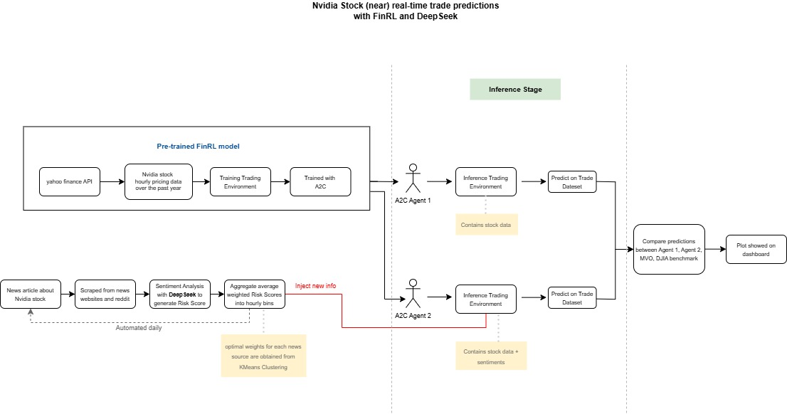
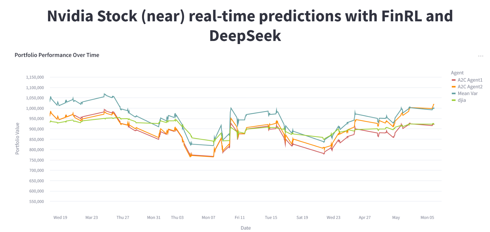

# 📈 Nvidia stock (near) real-time predictions with FinRL and DeepSeek using financial news market sentiment

## Overview
This project explores the integration of financial AI tools to enhance real-time decision-making in stock trading, specifically focusing on Nvidia (NVDA) stock. By incorporating market sentiment derived from financial news into trading strategies, the system aims to improve portfolio performance through more informed predictions.

## Objectives
- Leverage FinRL and DeepSeek for algorithmic trading and sentiment analysis.
- Integrate recent financial news sentiment related to Nvidia into the agent's custom trading environment.
- Compare the performance of sentiment-aware trading strategies against traditional baselines.

## Methodology
- **Data Collection**: Due to API limitations (which restrict historical access to news articles older than three days), a custom scraper runs every 13 hours to collect the latest financial news relevant to Nvidia.

- **Model Training**: Using the FinRL library, a model is pre-trained on hourly Nvidia stock price data from the past year. This forms the foundation for inference.

- **Inference**:
  - Agent 1: Trades based solely on historical stock prices.
  - Agent 2: Incorporates both stock price data and extracted market sentiment into its custom trading environment.

- **Evaluation**: The performance of both agents is benchmarked against the Dow Jones Industrial Average (DJIA) and a Mean-Variance Optimization (MVO) portfolio.

A representation of the process flow is as shown in the diagram below.
 

 

## Dashboard 
This project supports the visualization of the results in a dashboard app, as shown below. It can opened from the `dashboard` folder.

Example: 
 

 

### Disclaimer
This project is done as part of the studies in BSc. Computer Science and AI at Technische Hochschule Ingolstadt. This project uses libraries and models from FinRL and DeepSeek. All rights, ownership, and intellectual property related to these tools belong to their respective creators and organizations. This repository is for educational purposes only and does not claim ownership or authorship of the original models or libraries.

